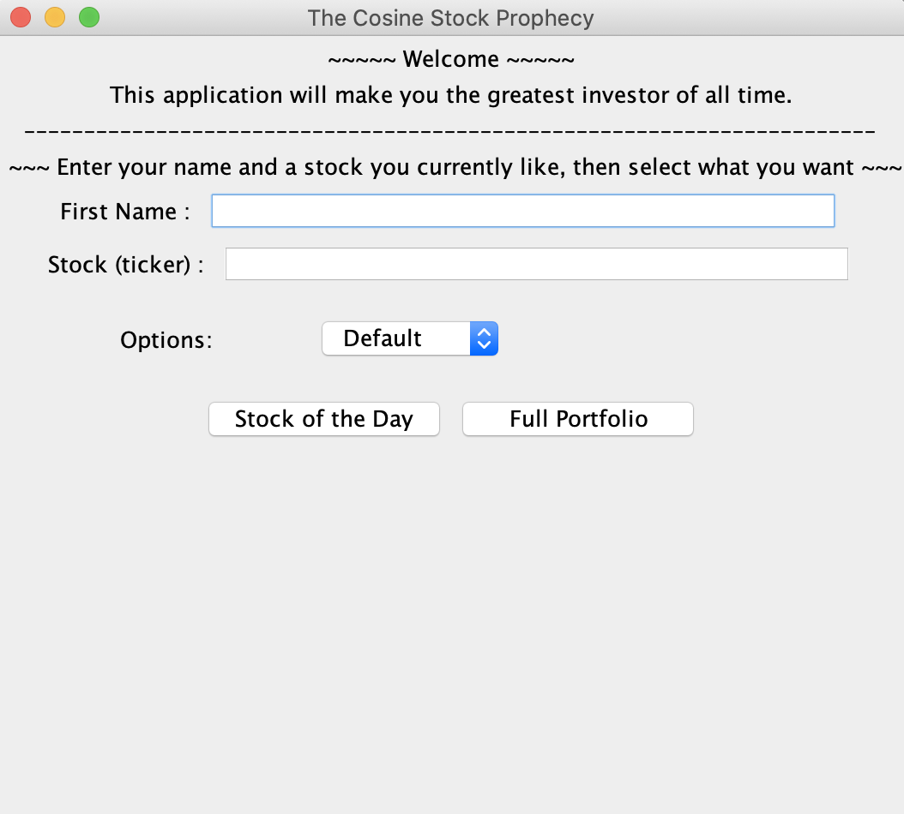
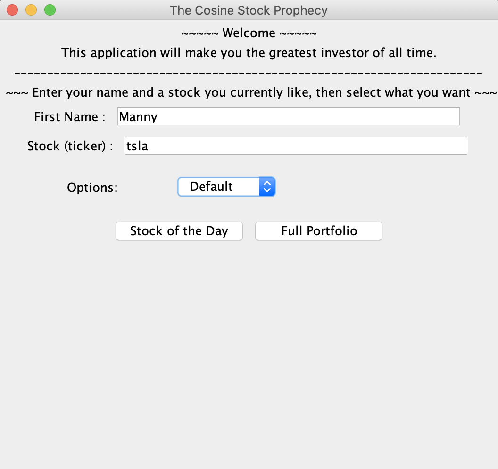
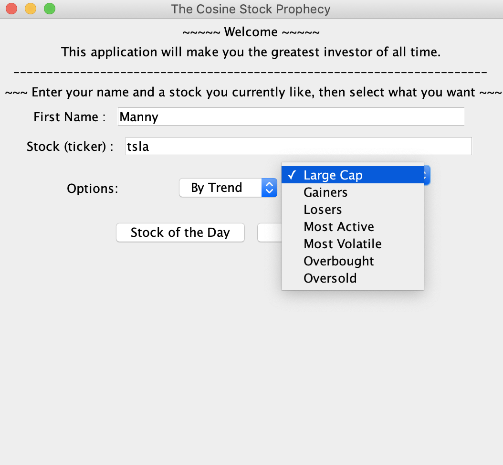
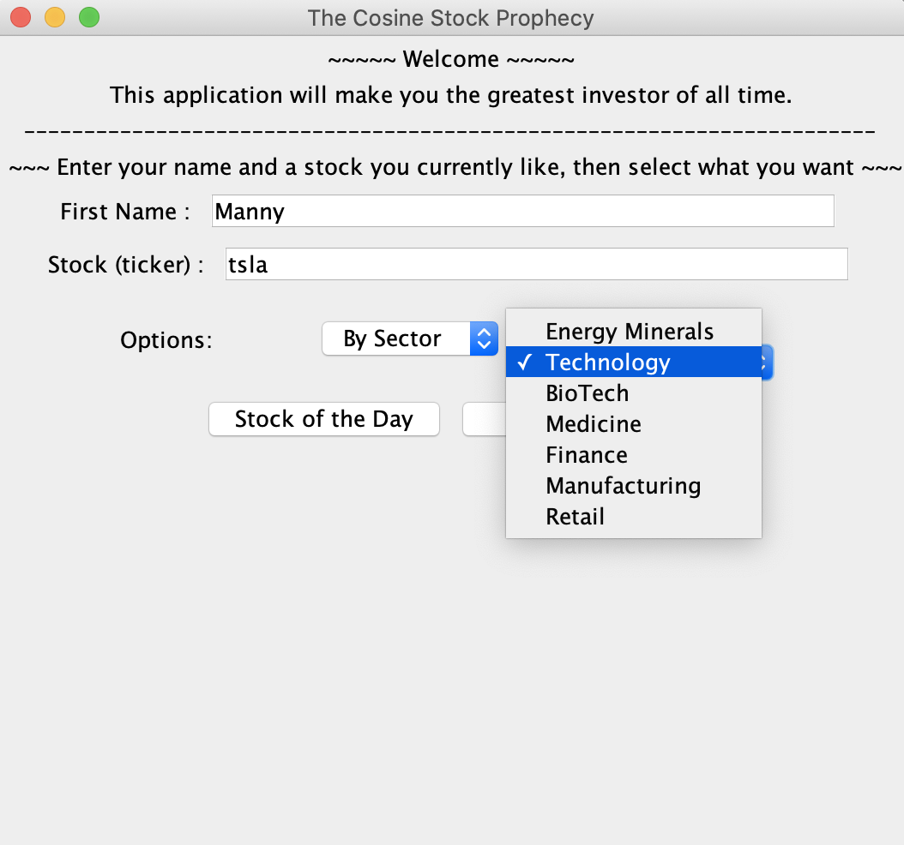
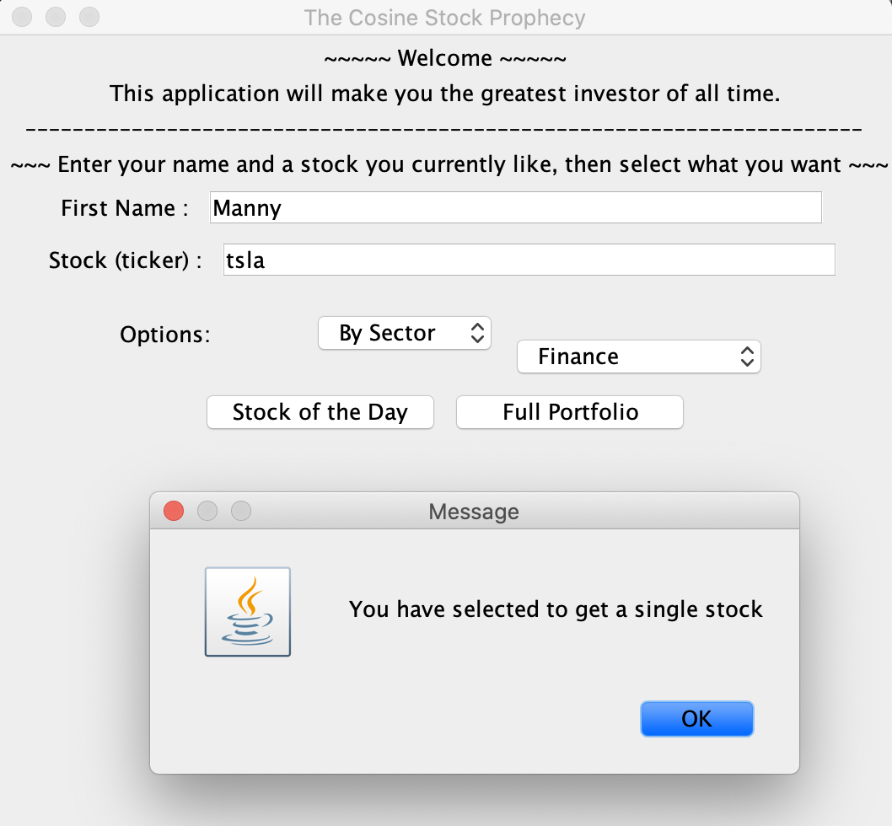
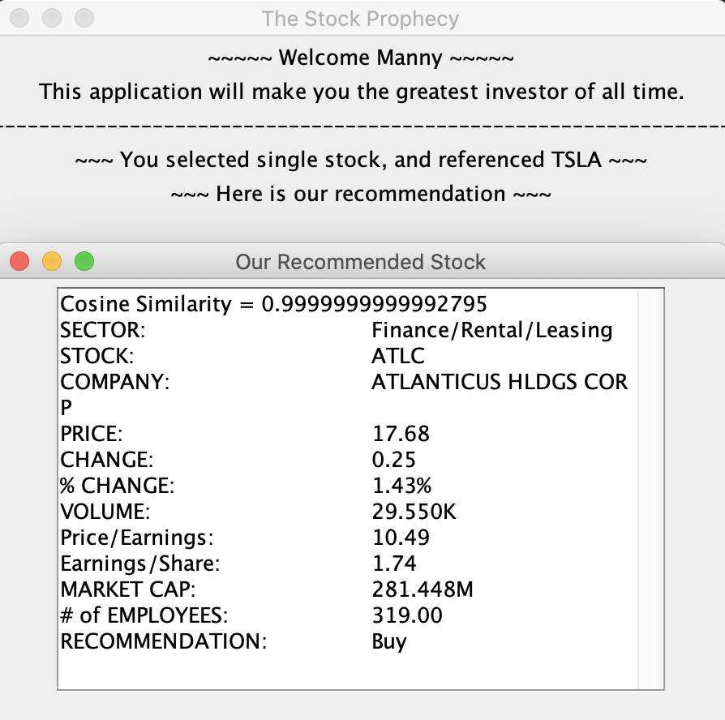
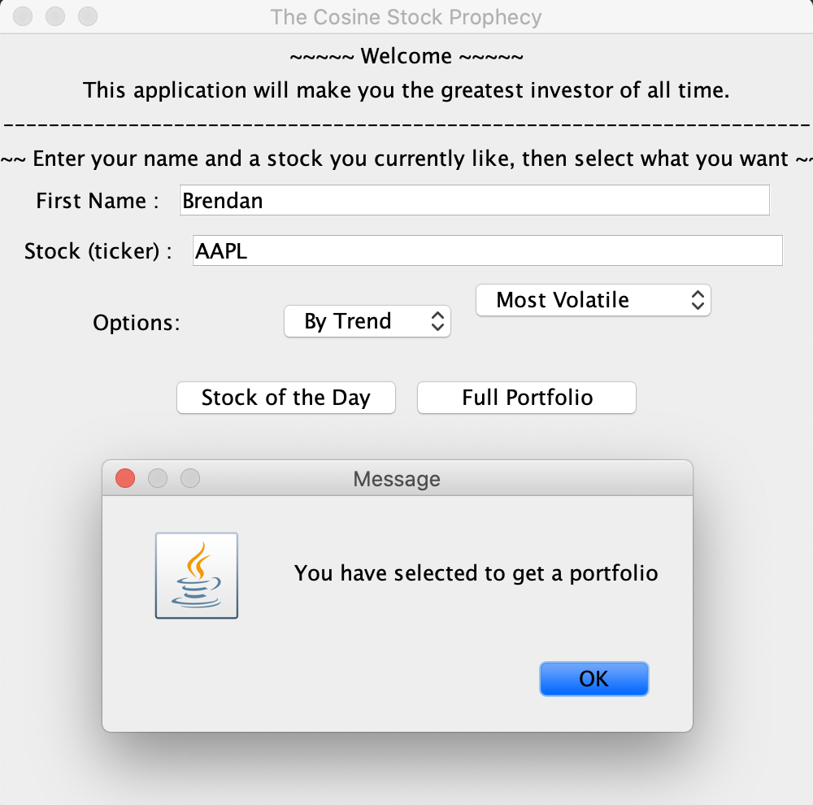
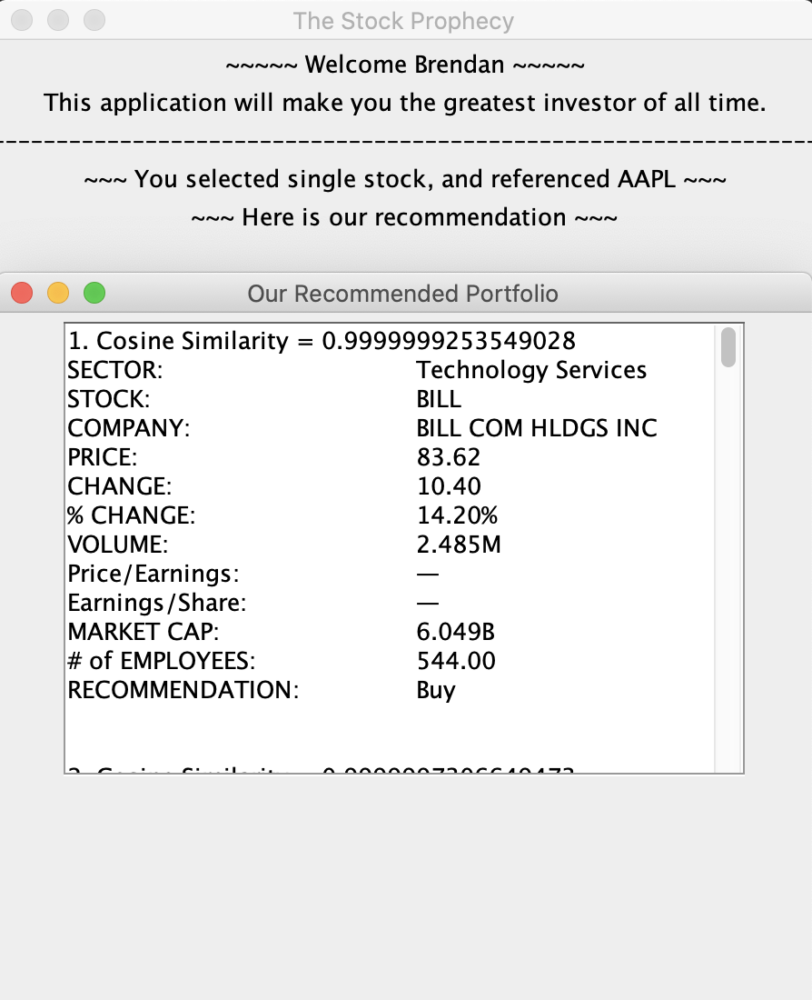
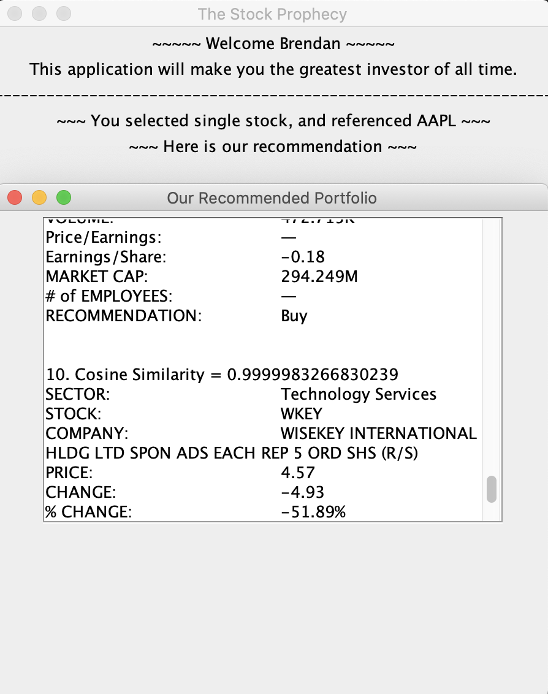

# The Stock Prophecy User Manual

This program, developed by Brendan McCaffrey and [Emanuel Kuflik](https://github.com/MannyKuflik), is a simple Java application that utilizes web scraping, cosine similarity vectors, and Java Swing UI to give the user an enjoyable and valuable experience. 

## Project Description

The application presents the user with a welcome screen in which he/she can input his/her name and the ticker of a stock they like, along with other optional settings. The user then selects to receive a single stock recommendation or a full portfolio of stocks put together by our algorithms. Our program utilizes cosine similarity and real-time web-scraping of financial information to come up with the best stocks for the user. Perfect for coming up with new investing ideas or finding companies you'd probably be interested in, that you may have never considered.

## Running the Program
#### Setup
To setup our program on your own machine simply download/clone this repo into a java editor such as [Eclipse](https://www.eclipse.org/downloads/), and configure your build path to include the Jsoup.jar and run main in our Main.java file. And that's it! It's really that simple.

#### Welcome Screen
Upon running the program, you will be presented with the following Welcome Screen:

#### Filling Out Your Information
Start by filling out your name and a stock you are currently interested as shown in the example below. Here we have chosen to use Tesla as our reference stock:

#### Options/By Trend
If you want to specify your search we offer different parameters that will change the recommendation you receive. One of these options is to select a specific current trend you would like your recommended stock to fit. By selecting this you get access to all of the trends shown below:

#### Options/By Sector
Similarly you may also decide you want to recieve a recommendation from a specific sector, which will grant you a choice from the various sectors pictured below:

#### Single Stock
Finally, you are ready to recieve your recommendation. In our example below we have chosen to receive a single stock recommendation for Tesla, searching only in the sector of Finance. Selecting "Stock of the Day" you will see the following prompt to asure you that your request has been processed:

#### Single Stock Results
Here is what your recommendation will look like for a single stock. You will receive one stock that we have chosen for you, along with the relevant statistics for the recommended stock as well as a recommendation on whether to buy that stock or not. You will also be able to see our calculated Cosine Similarity value, which is a measure on a scale from 0(completely different) to 1(completely identical) of how similar the stock we have found for you is to your reference stock in terms of key statistics such as Market Cap, Price, and P/E, among others:

#### Portfolio
The other type of recommendation you can decide to receive is a full portfolio of stocks similar to your reference stock. In our example below we have chosen to receive a portfolio of stock recommendations for Apple, searching only by the trend of the most volatile current stocks. Selecting "Full Portfolio" you will see the following prompt to asure you that your request has been processed:

#### Portfolio Results
Here is what your recommendation will look like for a full portfolio. You will receive the ten stocks with the highest cosine similarities to your reference stock, along with all of the other relevant data described for a single stock selection above. You can svroll through your results to check out all 10 stocks we have recommended:

## Final Remarks
And that's it! We have developed for you an easy-to-use, powerful tool that works in real-time and will enable you to get an edge over the competition and step-up your investing game to the next level. We hope you enjoy it and best of luck investing!
